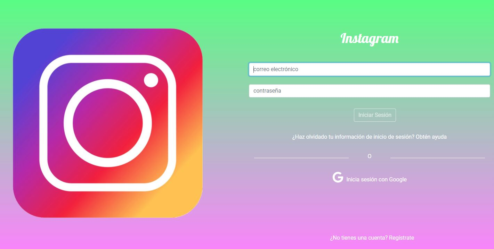
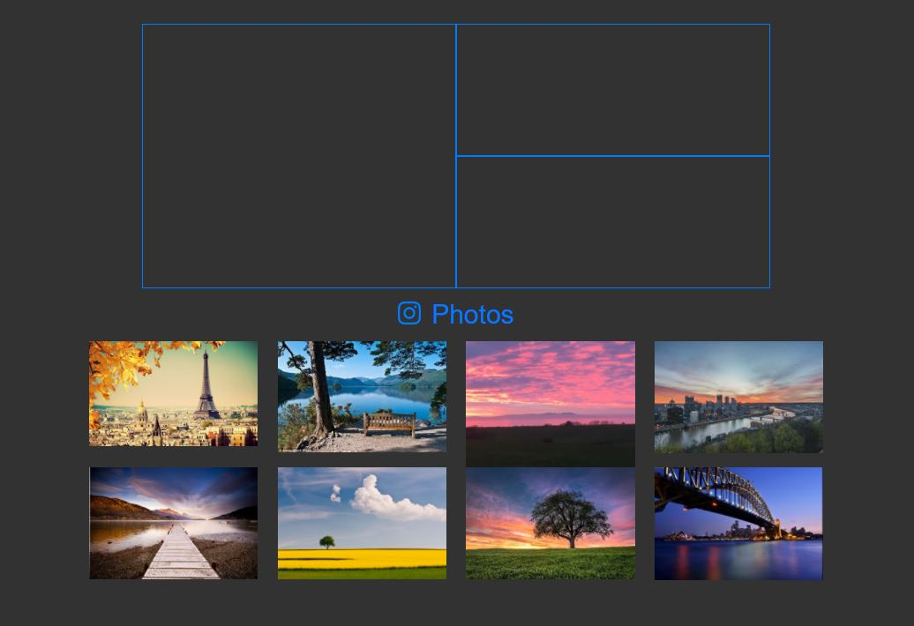
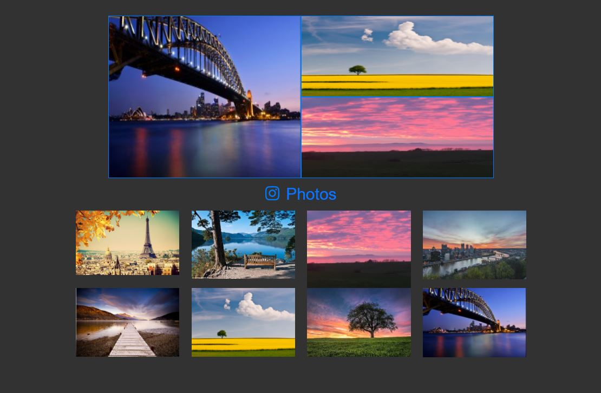

# Insta Collage
>*__Integrantes:__ Lucero Hospina y Milagros Palma*

## Descripción

* Insta Collage es un ejercicio práctico sobre el api de _**Drag & Drop**_ de HTML5.

* Se implementa una réplica del app Layout de _**Instagram**_.

* Sobre la funcionalidad:

  1. Se muestra como inicio un formulario de inicio de sesión validado e implementado con firebase para el ingreso con cuenta de Google.

  2. En la vista principal se pueden seleccionar las imágenes y arrástrarlas hasta los casilleros de la parte superior; quedando las imágenes fijas y simulando un collage.

  3. Se nos solicitó implementarlo para vista desktop. 

## Vistas del Proyecto

## Herramientas
`HTML5` `CSS3` `JavaScript` `DND` `Bootstrap 4` `Firebase`